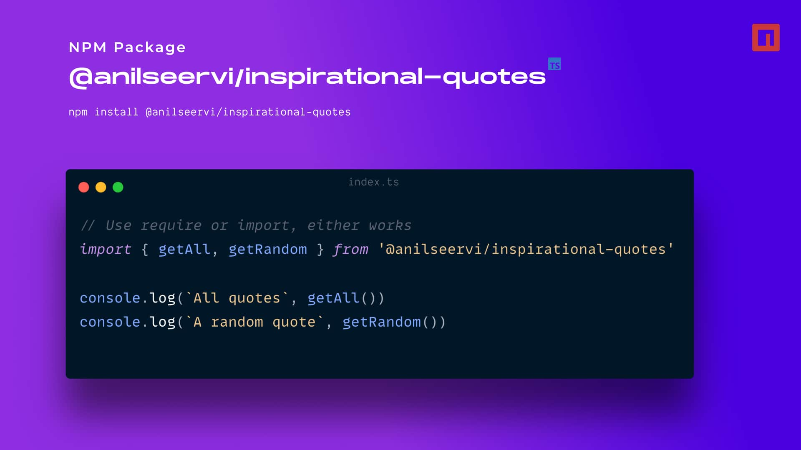

<div align="center">

# :zap: Inspirational Quotes :zap:

Get Inspired!

[](https://www.npmjs.org/package/@anilseervi/inspirational-quotes) [](https://github.com/anilseervi/inspirational-quotes/blob/master/LICENSE) [](https://www.npmjs.com/package/@anilseervi/inspirational-quotes) [](https://www.npmjs.com/package/@anilseervi/inspirational-quotes) [](https://github.com/anilseervi/inspirational-quotes/pulls)



</div>

## Installation

**NPM**:

```shell
npm install @anilseervi/inspirational-quotes
```

**Yarn**:

```shell
yarn add @anilseervi/inspirational-quotes
```

## Usage

Check out all the [existing quotes](./src/quotes.ts).

Following exports are available from the module:

- `getAll()` - returns all quotes
- `getRandom()` - returns a random quote

The result is in the following shape:

```json
{
  "quote": "Always bet on JavaScript!",
  "author": "Brendan Eich"
}
```

Some quotes optionally have the `source` key. For example:

```json
{
  "quote": "Amateurs know that contributing something is better than contributing nothing.",
  "author": "Austin Kleon",
  "source": "Show Your Work!"
}
```

### Example

```js
// Use require or import, either works
import { getAll, getRandom } from '@anilseervi/inspirational-quotes'

console.log(`All quotes`, getAll())
console.log(`A random quote`, getRandom())
```

## Contributing

Contributions are welcome! Please read the [contributing guidelines](./CONTRIBUTING.md) first.

## Author

- :raised_hands: [@anilseervi](https://twitter.com/linaseervi) :large_blue_circle:
